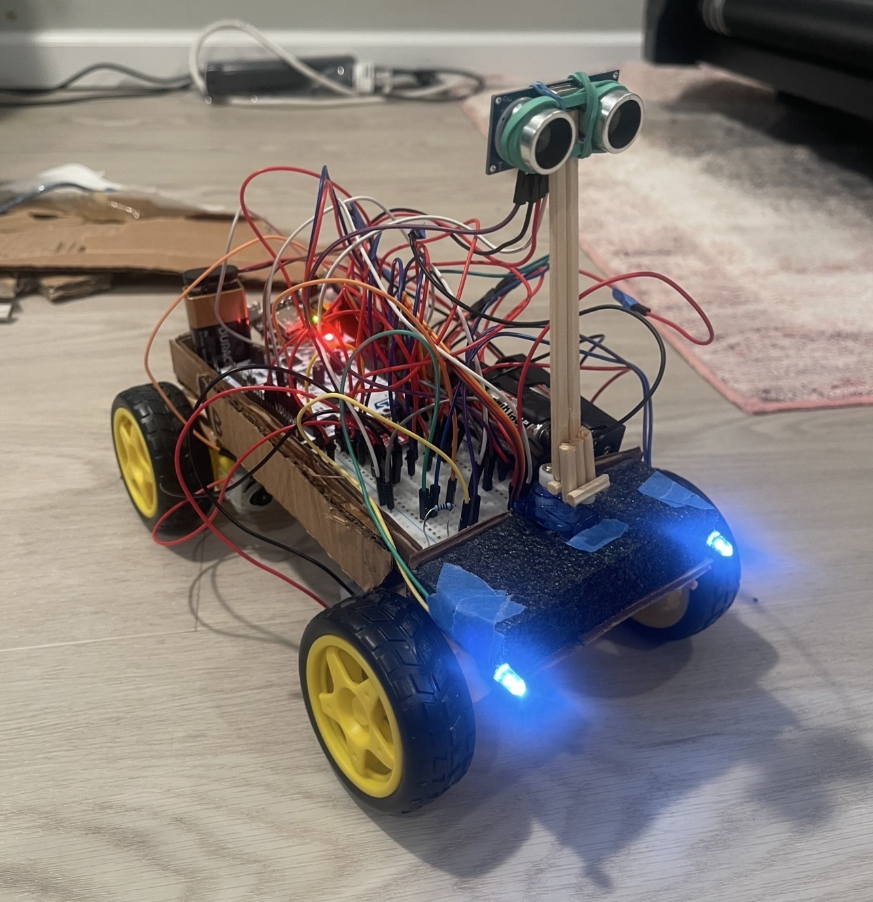
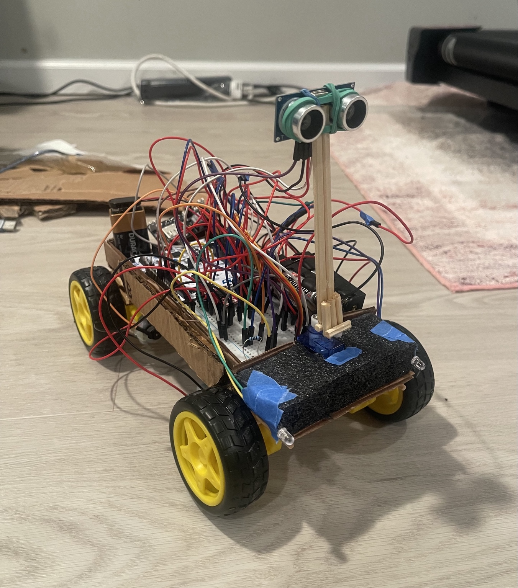
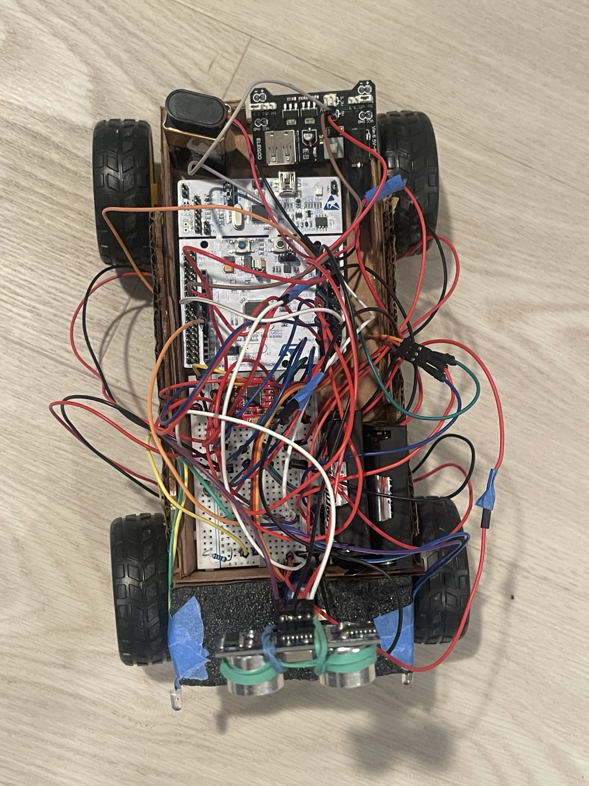
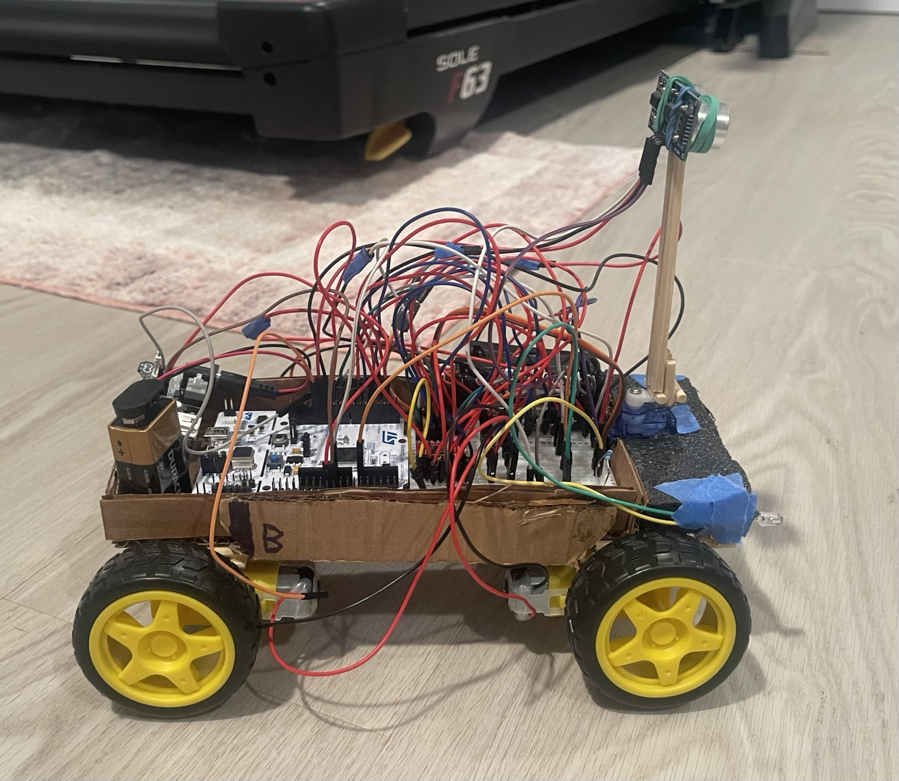
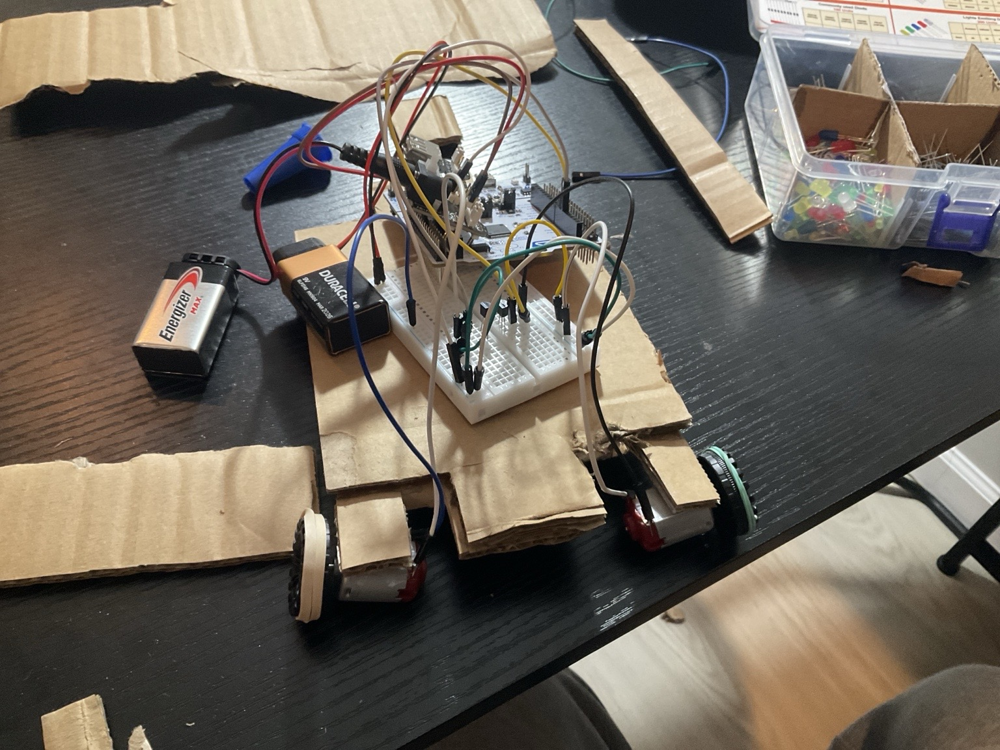
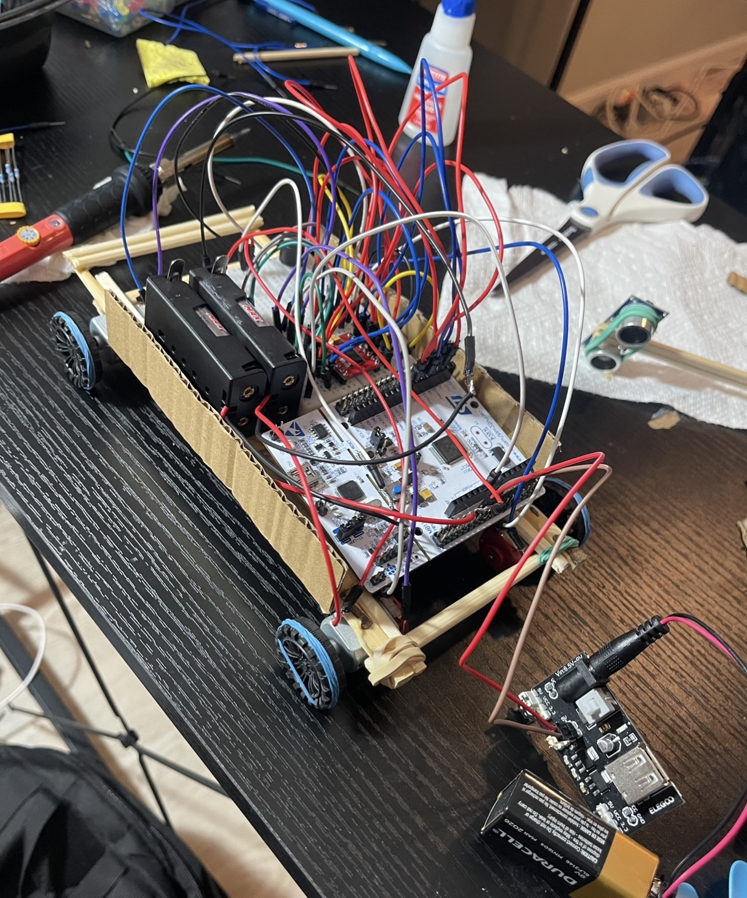
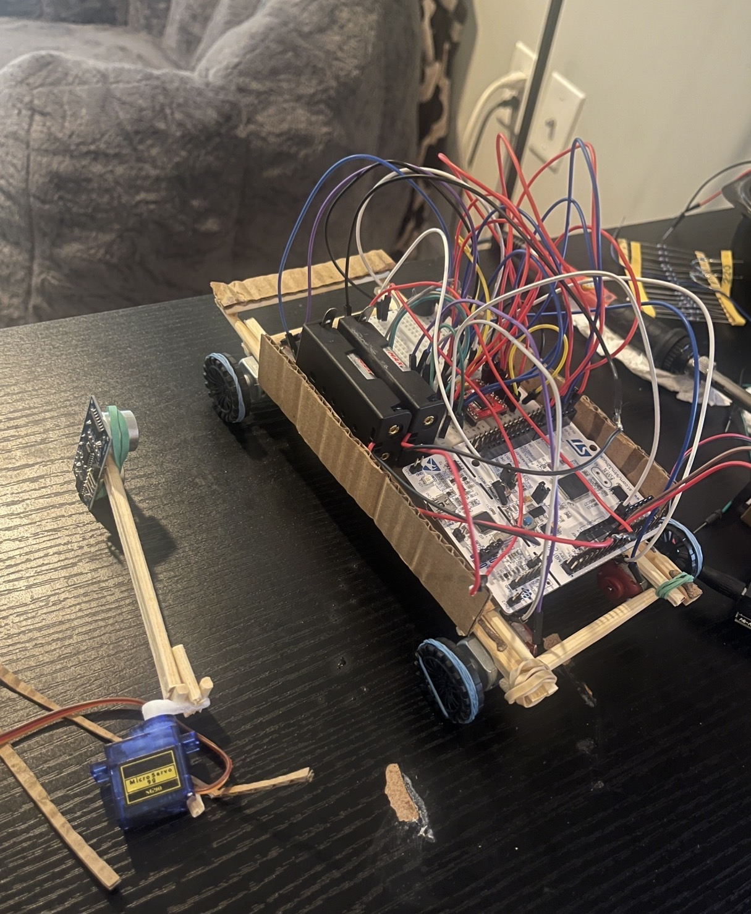
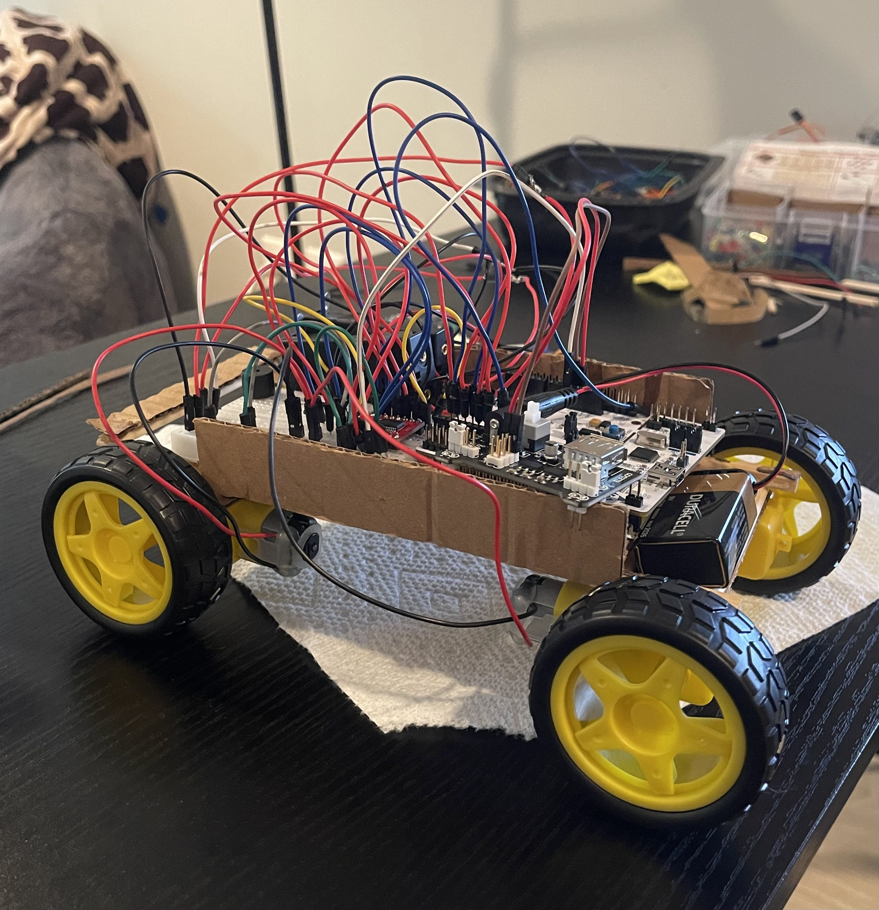

# STM32-Autonomous-Mobile-Robot

This is a from-scratch autonomous mobile robot built around the STM32 NUCLEO-F446RE.

The goal of the project was to build a robot that could move around on its own, detect obstacles, scan its surroundings, and decide which direction to turn without relying on high-level robotics libraries.

The robot uses a servo-mounted ultrasonic sensor to scan left, center, and right. Distance measurements are processed by the STM32, which then decides whether to keep moving forward or turn toward the direction with more open space.

## Demo

[Watch the robot navigate autonomously on YouTube](https://youtube.com/shorts/Af4F2vDJBIc?is=gysdv3sMcjRtJqm6)

## Features

- Autonomous obstacle avoidance
- STM32-based control
- Servo-mounted ultrasonic scanning
- Four-wheel differential/skid steering
- Independent PWM control for left and right motor sides
- UART serial output for debugging and sensor data
- Front LED headlights
- Custom-built cardboard prototype chassis
- Separate power rails for motors, servo, and control electronics

## Hardware

- STM32 NUCLEO-F446RE
- TB6612FNG dual motor driver
- 4x geared DC motors
- 4x wheels
- SG90 micro servo
- HC-SR04 ultrasonic distance sensor
- Breadboard and jumper wires
- LEDs and current-limiting resistors
- Transistor-based LED switching
- Battery packs / external power supplies
- A 9V Battery & Voltage Regulator
- Custom cardboard and wood chassis

## How It Works

The robot continuously measures the distance directly in front of it.

If the distance to the nearest object forwards is farther than a certain threshold (75 cm) it continues driving forward.

If an obstacle is detected within the threshold, the robot stops and scans both sides using the ultrasonic sensor mounted on the servo.

The STM32 compares the left and right distance measurements and turns toward the side with more available space. Then it starts over scanning the front again. 

## Ultrasonic Distance Measurement

The ultrasonic sensor is triggered using a short GPIO pulse.

The STM32 then measures the duration of the ECHO pulse using a hardware timer configured with a 1 microsecond time base.

Distance is calculated from the measured round-trip travel time of the sound wave:

float distance_cm = ((float)echo_time_us / 1000000.0f) * 343.0f / 2.0f * 100.0f;

This converts the measured echo time (in microseconds) the sound took to travel into distance in centimeters the object is from the sensor. 

## Servo Scanning

The ultrasonic sensor is mounted on an SG90 servo.

The robot currently uses three scan positions:
0 degrees -> Right
90 degrees -> Straight
180 degrees -> Left

The servo is controlled using a 50 Hz PWM signal generated by an STM32 timer.

After the servo reaches each position, the ultrasonic sensor takes a distance measurement.

## Motor Control

The four DC motors are controlled through a TB6612FNG dual H-bridge motor driver.

The two motors on each side are controlled together.

Separate PWM channels are used for the left and right sides, which also allows small speed corrections to compensate for differences between motors.

Motor PWM runs at approximately 20 kHz.

The robot can:

* Drive forward
* Reverse
* Stop
* Turn left
* Turn right

## UART Debugging

I used USART2 for serial debugging and to be able to print stuff. I configured the baud rate to 115200 and outputted it in a serial monitor.

The STM32 sends information such as:

Straight: 84 cm
Left: 51 cm | Right: 127 cm
Turning right

This was super useful for testing the ultrasonic sensor, servo positions, and navigation logic.

## V1 Build & Photos

This project went through several hardware iterations before reaching the current version.

The V1 chassis was built manually from cardboard, foam, and wooden supports rather than using a premade robot chassis.

The final V1 uses four motors, a front-mounted scanning ultrasonic sensor, onboard power supplies, and front LED headlights.

Front View

Front View - STM32 and Front Lights Powered

Top View

Side View

## Current Status

V1 is functional.

The robot can currently navigate around a room autonomously by detecting obstacles, scanning its surroundings, and choosing a direction to turn.

Future versions may include:

* Improved wire management
* More robust power distribution
* Encoder-based motion feedback
* IMU-based heading measurement
* Improved turning accuracy
* Non-blocking control logic
* More advanced navigation algorithms, especially for more complex surroundings or different elevations.

## Development

This project was a huge learning experience for me, and built mainly as a way to learn embedded systems by working directly with:

* An STM32 microcontroller
* GPIO
* Hardware timers
* PWM
* UART
* Motor drivers
* Ultrasonic sensing
* Servo control
* Power distribution
* Embedded C
* Basic autonomous decision making
* Debugging

The project was intentionally built from scratch instead of following a complete robotics tutorial or using a premade autonomous car kit.

## Development Progress

The robot went through several hardware and mechanical iterations before reaching a working V1 state. These photos show some of the earlier prototypes and subsystem tests. 

Note: The original small DC motors did not provide enough torque to move the robot well under its own weight, so I replaced them with larger geared DC motors. 

